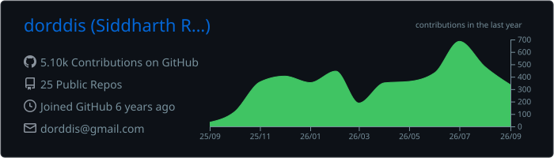
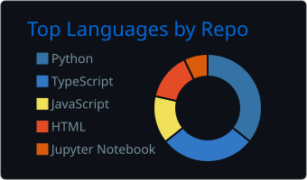
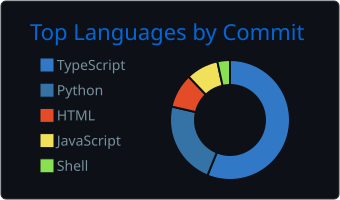
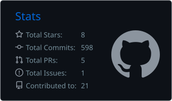
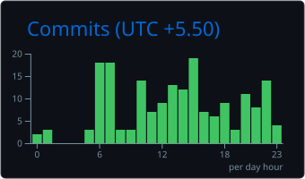

# Hey, I'm Sid

**AI Automation Engineer** | **$50K+ Contracts** | **$150K+ Value Delivered** | **92% Efficiency Gains**

I specialize in **production AI systems**: LLM pipelines, computer vision automation, real-time IoT integration, and enterprise-scale web scraping. My work focuses on measurable business impact—not prototypes that collect dust.

---

## Impact Highlights

| Project | Outcome |
|---------|---------|
| **Enterprise Web Scraping** | $136K annual savings, 50x throughput improvement |
| **AI Video QC System** | 92% time reduction (60 min → 5 min per video) |
| **LLM Content Pipeline** | 87% workflow automation, 70% zero-edit rate |
| **Real-Time IoT Integration** | 10Hz streaming, 50ms latency, 99.7% uptime |
| **Voice AI + CRM Automation** | 99% admin work eliminated, $15K revenue recovered |

---

## Featured Projects

### [Maritime Dark Ship Detection](https://github.com/dorddis/maritime-rag-project)
Real-time multi-sensor fusion detecting AIS-evading vessels. Gated GNN + Hungarian algorithm for track assignment, hybrid RAG with LangChain, 3D globe visualization processing 500+ vessels at 60fps.

`Python` `FastAPI` `Next.js` `Three.js` `PostgreSQL + pgvector` `Redis` `LangChain`

### [AI Portfolio with Generative UI](https://dorddis.vercel.app)
Interactive portfolio powered by Gemini 2.5 Flash with streaming tool calls. 5 custom tools, Zod validation, 70% token reduction via hybrid context architecture. Multi-layer security blocking 26 penetration vectors.

`Next.js 15` `React 19` `Vercel AI SDK 5.x` `TypeScript` `Redis` `Cloudflare Turnstile`

### [EggyPro - E-commerce Platform](https://github.com/dorddis/EggyPro)
Full-stack e-commerce with real-time admin dashboard, Stripe payments, inventory monitoring, and Gemini-powered FAQ automating 70% of customer queries.

`Next.js` `Supabase` `PostgreSQL` `Drizzle ORM` `Stripe` `Gemini 2.5`

---

## Tech Stack

**AI/ML** 

 

 

**Backend & Infrastructure** 

 

 

**Frontend** 

 

**Automation & Scraping** 

 

**Integrations & APIs** 

 

---

## What I Build

- **LLM-Powered Automation** — Content pipelines, document processing, AI agents with tool calling
- **Computer Vision Systems** — Video QC, OCR pipelines, quality detection
- **Real-Time Data Systems** — IoT integration, streaming protocols, live dashboards
- **Enterprise Automation** — CRM workflows, lead enrichment, web scraping infrastructure

---

## Currently

Building AI automation systems as a **Founding Engineer**. Open to **US remote opportunities** in AI/ML engineering, automation, or founding engineer roles.

**Let's talk:** [dorddis@gmail.com](mailto:dorddis@gmail.com) | [LinkedIn](https://linkedin.com/in/dorddis) | [Portfolio](https://dorddis.vercel.app)

---

## GitHub Stats

  

  
  

  
  

